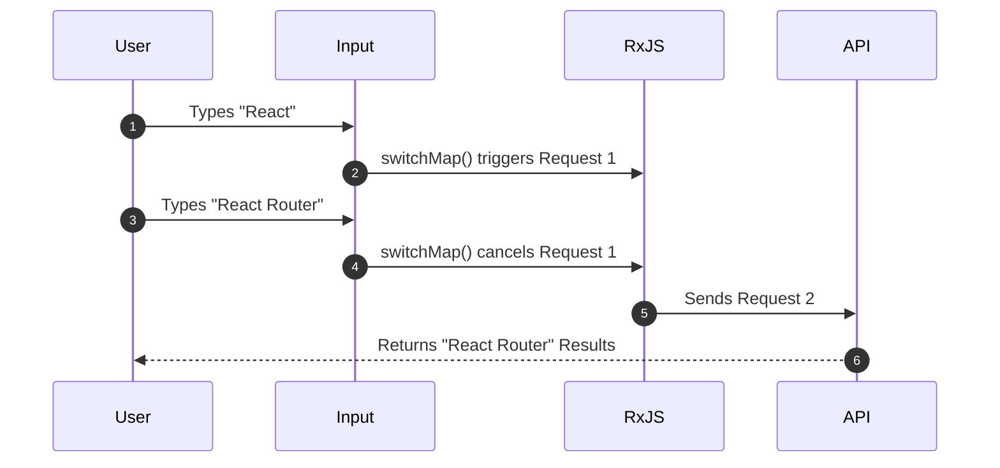

```typescript
import { fromEvent } from 'rxjs';
import { switchMap } from 'rxjs/operators';

// Cancels previous search HTTP requests if a new input event occurs
const searchInput$ = fromEvent(document.getElementById('search'), 'input');
const result$= searchInput$.pipe(
  switchMap(event => fetchSearchResults(event.target.value))
);
```

